# Shkr! app
__________
# TO DO before submitting
- change to public
- check spelling
________________

## API 
https://www.thecocktaildb.com/api.php

## T3iiA1A Anastasia Dyakova, Patrick Hamer

## R1 Description of our website
The purpose of this website is to provide an easy to use cocktail recipe book for liquor distributors to provide to bartenders as a means of promoting their product. Arming bartenders with easy access to a multitude of recipes will allow them to keep the distributor's products front of mind and more importantly front of house and in the customer's hands.
The website includes a library of drink recipes, searchable by ingredient. Upon searching for an ingredient a random drink using that ingredient will be provided with recipe, picture and method. The app will also provide admin users the ability to remove certain drinks from the randomizing function so that specific drinks can be excluded from the search results, as well as manipulating the database to maintain brands across different recipes.

The main target audiences for this app are:
- **Bartenders** so they can keep a brand's products front and center, providing them with different experiences for the customer every time they visit
- **Home cocktail enthusiasts** encouraging those with a mixological passion to explore new ways to create delicious drinks all the while keeping a strong presence of brand in their recipes.

Tech stack: 
| Application and Data | Utilities | DevOps | Business Tools|
|:--------------------:|:---------:|:------:|:-------------:|
|HTML 5                |JWT        |Github  |Discord        |
|CSS                   |NPM        |Git     |Zoom           |
|JavaScript ES6        |Postman    |VSCode  |WhatsApp       |
|React                 |Jest       |        |Trello         |
|Express               |Supertest  |
|NodeJS                |
|MongoDB               |
|Mongoose              |
|Helmet                |
|Netlify               |
|Railway               |
|Atlas                 |
|bcrypt                |
|Axios                 |

## R2 DataFlow Diagram
The first DFD presented to the educators was admittedly not the greatest: 
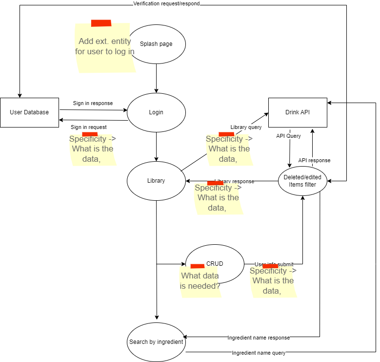
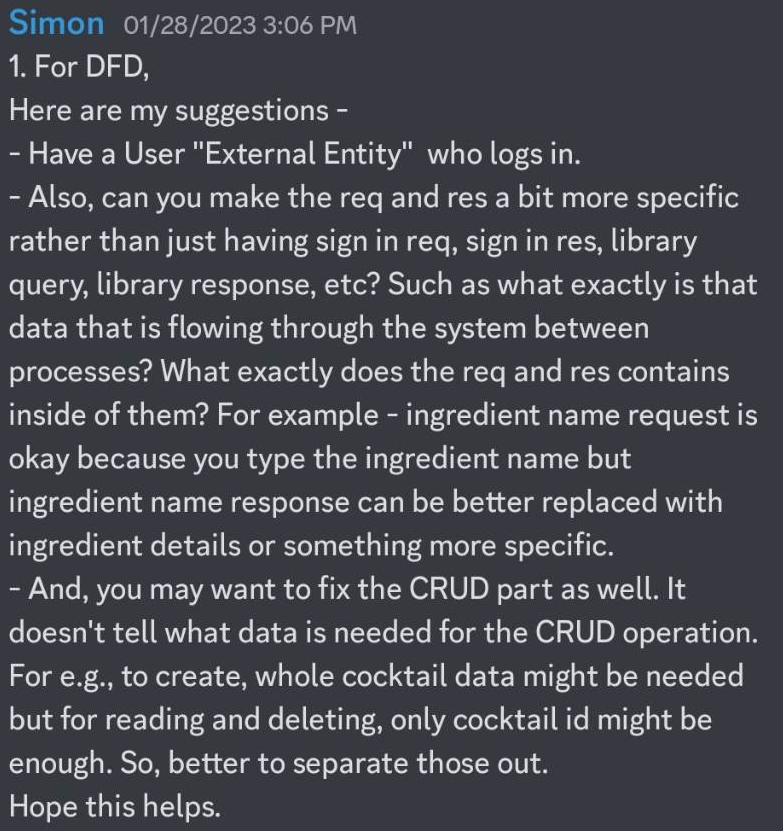
However after taking notes, doing some more research on how to properly structure the DFD and then re-presenting great progress was made:
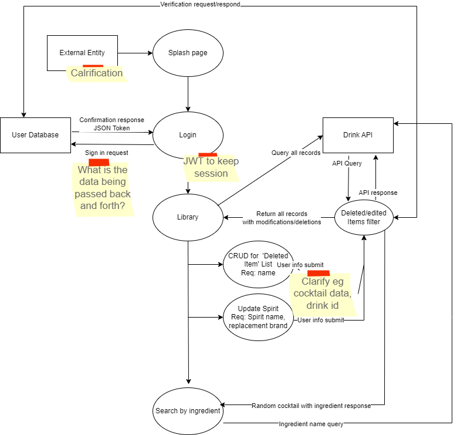
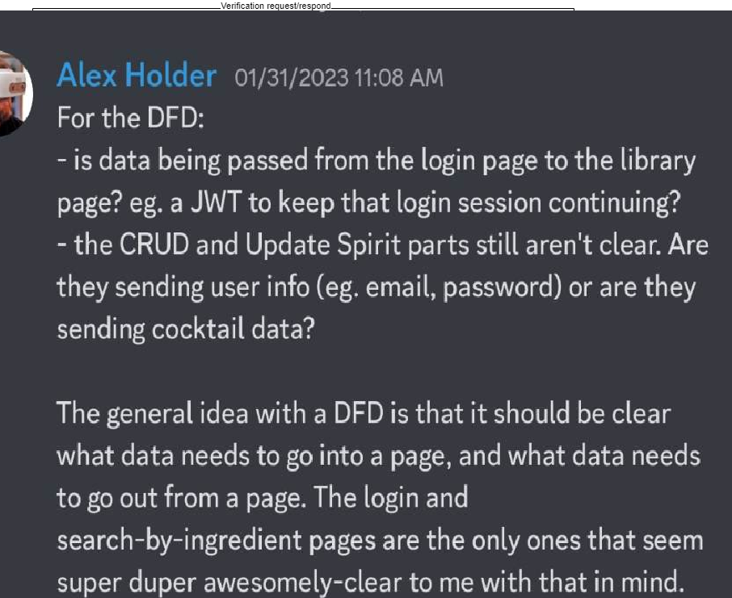
Still however, while the structure had improved the information pertaining to actual data being sent was still not clear enough. This was taken very serously as perperation _is_ 90% of execution, so we needed to have a solid base from which to start our app. The third attempt had only a few minor issues:

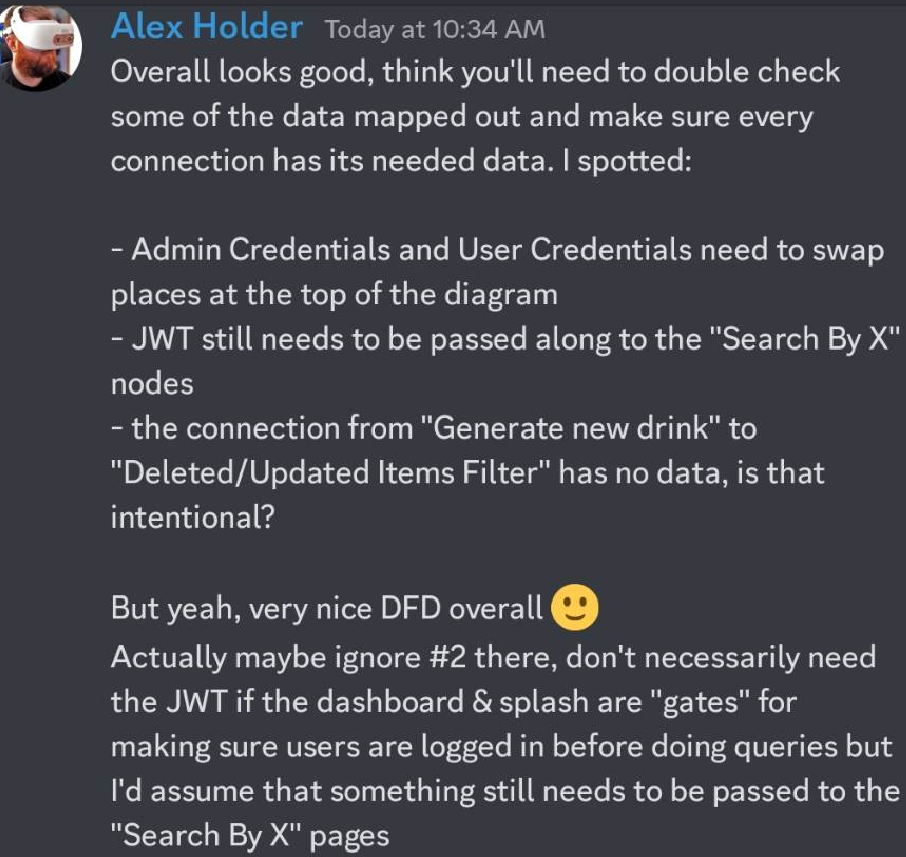
Some of these were oversights simply from being up all night staring at it, and some were due to a disorganized files. Whatever the case, with the assistance of our educators the final result was approved on 02/02 much to our delight. The final DFD is compiled thusly

## R3 Application Architecture Diagram 
The first draft:
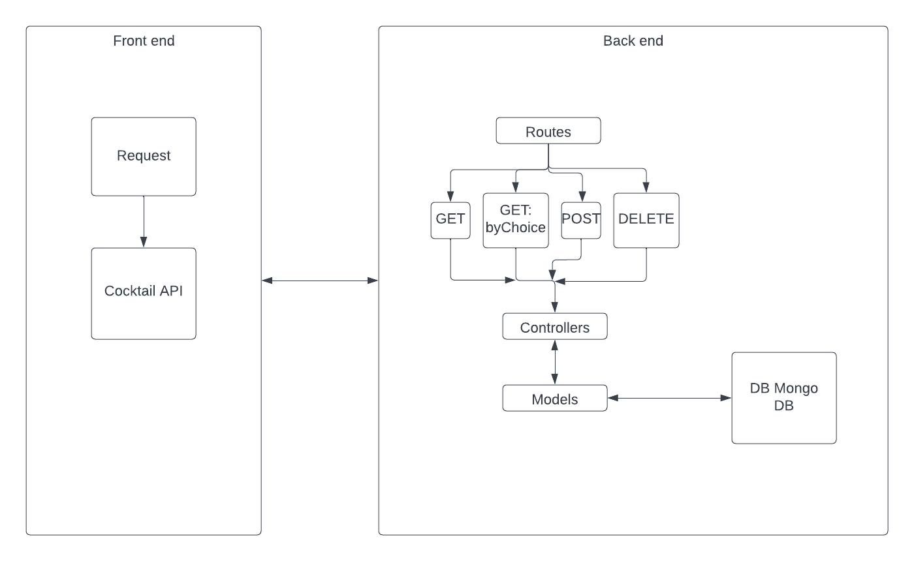
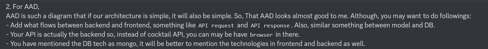
- Explained the connection between Front end and Back end
- External API moved to Back end section
- Added using tools
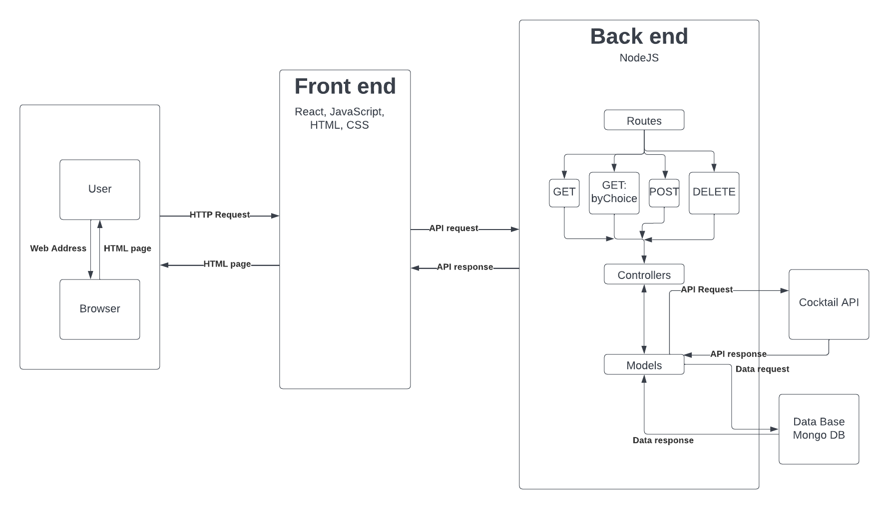
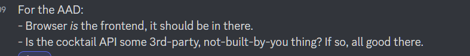
- User moved to outisde of Front and Back structure
- API clarified as a 3rf party
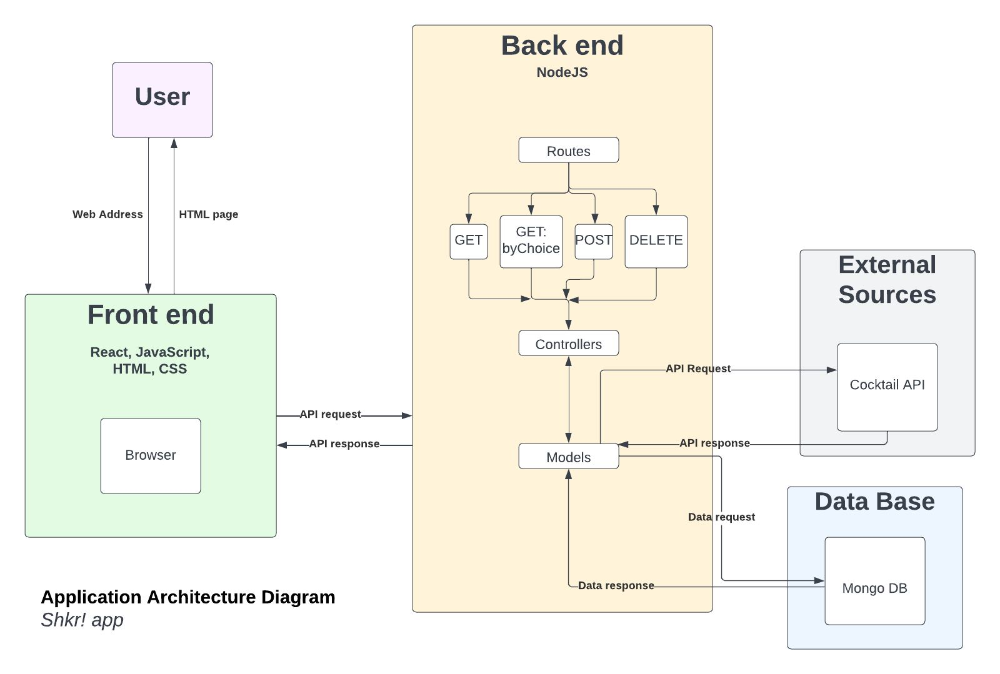

## R4 User Stories
**Who**: The bartender. Big spirit selection, incentivised for selling branded products, upselling capabilities to the max. 
**Age**: Mid 20's to mid 30's  
**Occupation**: Bartender  
**Location** Inner suburbs/CBD Bars  
 
**What is the problem this user requires solving**: As a bartender I am looking for a comprehensive, easy to use recipe book that I can use quickly and discreetly to get recipes while I am mid-service behind a busy bar. I need to be able to **search by an ingredient** base in case the customer requests so as well as **browse the library** to furhter my knowledge over my lunch break. Certain drinks that may be inappropriate/illegal in my region should be **able to be removed** from search results.

**Who**:The company rep/spirits ambassador  
**Age**: 20-40  
**Occupation**: Sales  
**Location**: Specified regions within the metropolitan area  
**What is the problem this user requires solving**: Creating an industry standard for cocktail recipes thus ensuring consistent products regardless of venue/staff member. Further to this the ability to **modify cocktail lists to replace generic words** like with brands from one's own stable, for example 'Vodka' being changed to 'Grey Goose'or Cola being changed to 'Coke' for greater brand promotion and recognition. This library needs to be **easily manipulated _by admin_** to ensure that our brand is front facing at all possible opportunities.  

**Who**: The home mixologist 
**Age**: 18+ 
**Occupation**: Any 
**Location**: Home 
 
**What is the problem this user requires solving**: Creating a cocktail with what I have at home. This could be to use up a particular bottle I have lying around and want to get rid of, creating a potion to imbibe with what I have on hand, exploring new ways of enjoying old favourites or impressing my friends with perfectly crafted beverages. Being able to make drinks that, at a base level, meet the standard I could expect in any bar I visit. I need to be able to **search for ingredient-specific drinks**, **look up specific drinks** or simply **browse a library** on the day before the party to see what I can conjur up to wow my guests. Information needs to be easily obtained and site feel needs to be intuitive so as to be able to be used on the fly.  

## R5 Wireframes for multiple standard screen sizes, created using industry standard software
__Pinterest Board__
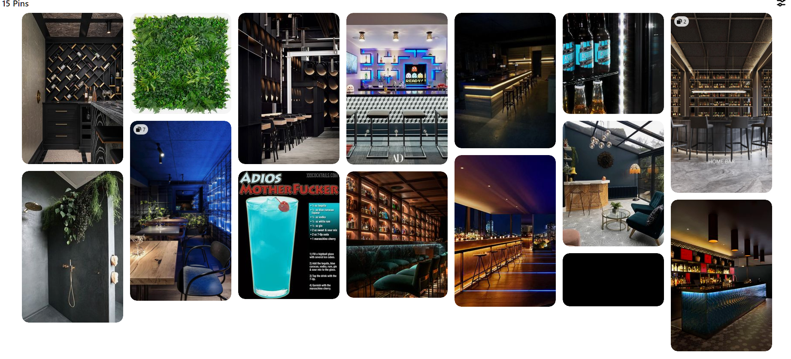  
__Color ideas__ 
Dark theme, green forrest  
__Color Pallette__
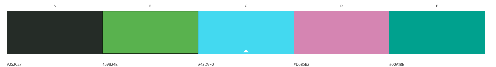

## R6 Screenshots of your Trello board throughout the duration of the project
Throughout the course of this assignment we allowed ourselves at least half an hour each working day to have a standup via phone or video call. This allowed us to keep abreast of what one another were doing, explore more intricate concepts and ideas as well as hash out some of the more obscure aspects of the app such as colours and design. Zoom was particularly efficient in this instance as it allowed for screen sharing.

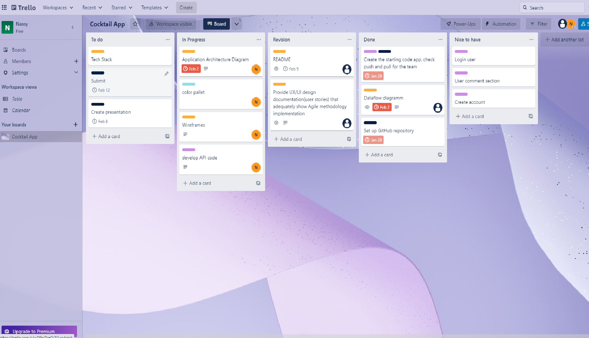