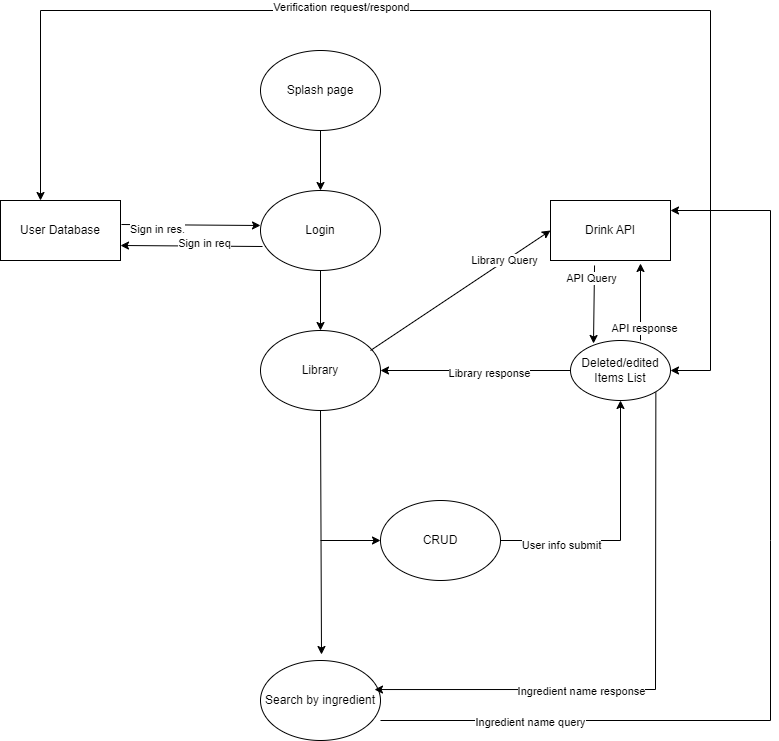
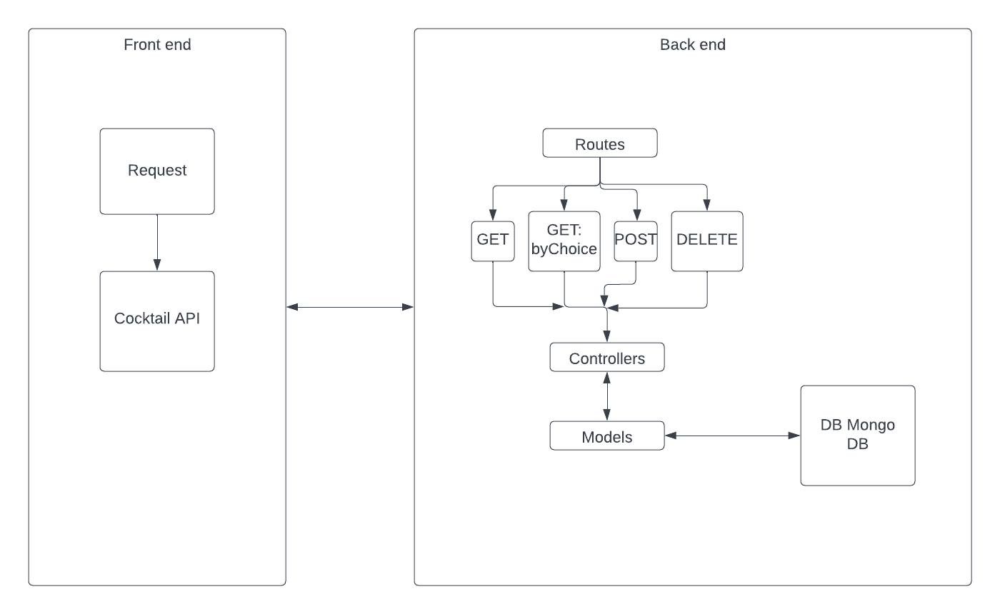
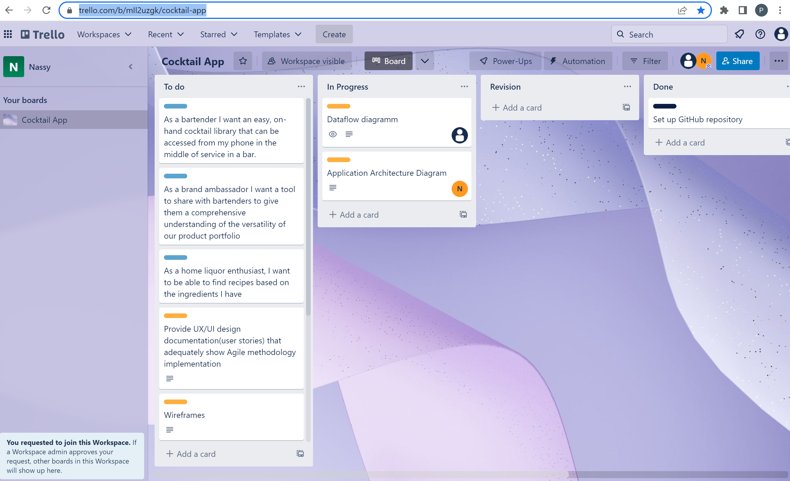

# Cocktail
## API 
https://www.thecocktaildb.com/api.php

# Cocktail App
## T3iiA1A Anastasia Kova, Patrick Hamer

## R1 Description of our website
The purpose of this website is to provide an easy to use cocktail recipe book for liquor distributors to provide to bartenders as a means of promoting their product. Arming bartenders with easy access to a multitude of recipes will allow them to keep the distributor's products front of mind and more importantly front of house and in the customer's hands.
The website includes a library of drink recipes, searchable by ingredient. Upon searching for an ingredient a random drink using that ingredient will be provided with recipe, picture and method. The app will also provide admin users the ability to remove certain drinks from the randomizing function so that specific drinks can be excluded from the search results.

The main target audiences for this app are:
- **Bartenders** so they can keep a brand's products front and center, providing them with different experiences for the customer every time they visit
- **Home cocktail enthusiasts** encouraging those with a mixological passion to explore new ways to create delicious drinks all the while keeping a strong presence of brand in their recipes.

Tech stack:

## R2 DataFlow Diagram

## R3 Application Architecture Diagram 

## R4 User Stories
**Who**: The bartender. Big spirit selection, incentivised for selling branded products, upselling capabilities to the max. 
**Age**: Mid 20's to mid 30's  
**Occupation**: Bartender  
**Location** Inner suburbs, CBD  
**What is the problem this user requires solving**: As a bartender I am looking for a comprehensive, easy to use recipe book that I can use quickly and discreetly to get recipes while I am mid-service behind a busy bar.

**Who**:The company rep/spirits ambassador  
**Age**: 20-40  
**Occupation**: Sales  
**Location**: Specified regions within the metropolitan area
**What is the problem this user requires solving**:

## R5

## R6
