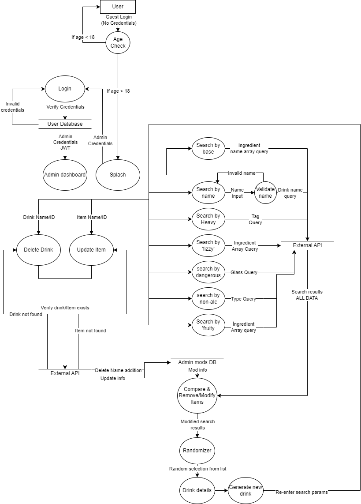
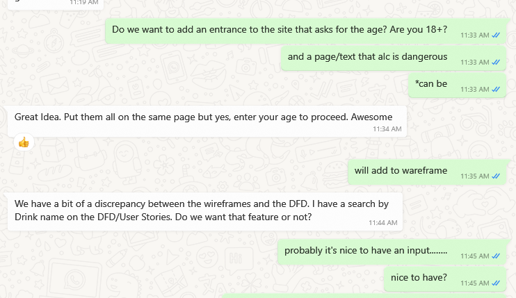
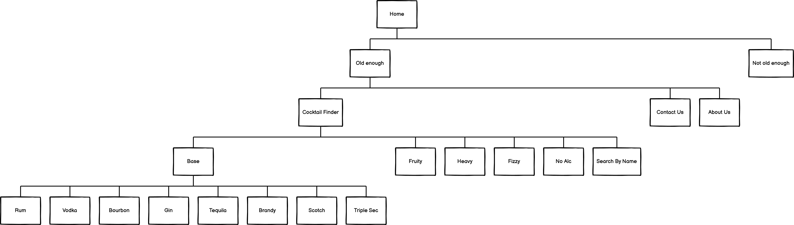
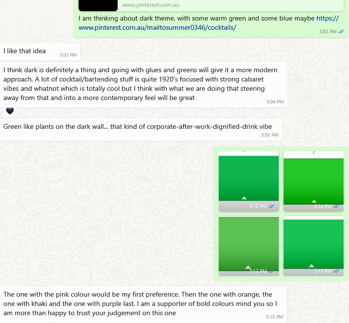

# Shkr! app
__________
# TO DO before submitting.
- change to public
- check spelling
________________

## T3iiA1A Anastasia Dyakova, Patrick Hamer

## R1 Description of our website
The purpose of this website is to create an easy-to-use cocktail recipe book for liquor distributors to provide to bartenders as a means of promoting their product. Arming bartenders with easy access to a multitude of recipes will allow them to keep the distributor's products front of mind and more importantly front of house and in the customer's hands. 
The website includes a library of drink recipes, searchable by ingredient, name, or various other genres according to taste. Upon searching for an ingredient, a random drink using that ingredient will be provided with recipe, picture and method. The app will also provide admin users the ability to remove certain drinks from the randomizing function so that specific drinks can be excluded from the search results, as well as manipulating the database to maintain brands across different recipes.

The main target audiences for this app are:
- **Bartenders** so they can keep a brand's products front and center, providing them with different experiences for the customer every time they visit, as well as ensuring consistency between colleagues.
- **Home cocktail enthusiasts** encouraging those with a mixological passion to explore new ways to create delicious drinks all the while keeping a strong presence of brand in their recipes.
- **Brand Ambassadors/Spirit reps** so they can promote their brand and encourage a consistency of drinks throughout venues, as well as having an easy promotional tool

|Tech stack: |
|---|

| Front End     | Back End      |Deployment| Utilities   | DevOps | Business Tools|
|:-------------:|:-------------:|:--------:|:-----------:|:------:|:-------------:|
|HTML 5         |JavaScript ES6 |Netlify   |Diagrams.net |GitHub  |Discord        |
|CSS            |Express        |Railway   |NPM          |Git     |Zoom           |
|JavaScript ES6 |NodeJS         |Atlas     |Postman      |VSCode  |WhatsApp       |
|React          |MongoDB        |Axios     |Jest         |        |Trello         |
|               |Mongoose       |          |Supertest    |
|               |bcrypt         |          |Balsamiq     |
|               |Helmet         |          |Lucichart    |
|               |JWT            |
|               |TheCocktailDB* |

*https://www.thecocktaildb.com/  

## R2 DataFlow Diagram
The first DFD presented to the educators was admittedly not the greatest: 

However, after taking notes, doing some more research on how to properly structure the DFD and then re-presenting great progress was made:

Still however, while the structure had improved the information pertaining to actual data being sent was still not clear enough. This was taken very seriously as preparation _is_ 90% of execution, so we needed to have a solid base from which to start our app. The third attempt had only a few minor issues:

Some of these were oversights simply from being up all-night staring at it, and some were due to disorganized files. Whatever the case, with the assistance of our educators the final result was approved on 02/02 much to our delight.   
 
This, of course, did not stop us. Oh no, we were excited, we were on a roll! Upon further discussion we realized that with the initial functionality of the app we could get rid of the user login and just have an open website but with a discreet admin login available to those with authorization.  

The final DFD is compiled thusly 
  

## R3 Application Architecture Diagram 
**The first draft:**

- Explained the connection between Front end and Back end
- External API moved to Back-end section
- Added using tools

- User moved to outside of Front and Back structure
- API clarified as a 3rd party

**The final version**
  

## R4 User Stories

User stories on the surface appeared to be pretty easy to conjure up as the app is pretty straight forward. However, when we started putting even just the DFD together we came to realize that in actual fact what we thought were intuitive ideas that would be easy to explain actually required further detail. The standups we were having throughout our working days were particularly helpful here as the minute we would discuss a new feature it could be incorporated into the user stories giving us a strong foundation that we could then refer back to.
 

As you can see in the above example (taken from GitHub comparisons), the stories were initially quite short with just a basic idea floated as to how this app would be used. As we really tried to put ourselves in the user's place though the User stories quickly expanded to include clarification of what exactly, but also _why_ the user's would require certain things. A prime example of this being that the app needs to be intuitive and simple for bartenders who are already trying to do a dozen things at once.
Considering these circumstances made us realise a certain urgency to this simplicity and we were able to proceed with our designs with this in mind.

**Who**: The bartender. Big spirit selection, incentivised for selling branded products, upselling capabilities to the max. 
**Age**: Mid 20's to mid 30's  
**Occupation**: Bartender  
**Location** Inner suburbs/CBD Bars  
 
**What is the problem this user requires solving**: As a bartender I am looking for a comprehensive, easy to use recipe book that I can use quickly and discreetly to get recipes while I am mid-service behind a busy bar. I need to be able to **search by an ingredient** base in the case of customer requests as well as **browse the library** to further my knowledge over my lunch break. Add to this the ability to **look up certain niche drinks**, for example non-alcoholic, or shots. Also, certain drinks that may be inappropriate/illegal in my region should be **able to be removed** from search results _with administrative approval_. App should be intuitive and able to be used on the fly to allow me to continue working with minimal interruption.
 
 

**Who**:The company rep/spirits ambassador  
**Age**: 20-40  
**Occupation**: Sales  
**Location**: Specified regions within the metropolitan area  
 
**What is the problem this user requires solving**: Creating an industry standard for cocktail recipes thus ensuring consistent products regardless of venue/staff member. Further to this the ability to **modify cocktail lists to replace generic words** with brands from one's own stable, for example 'Vodka' being changed to 'Grey Goose'or Cola being changed to 'Coke' for greater brand promotion and recognition. This library needs to be **easily manipulated _by admin_** to ensure that our brand is front facing at all possible opportunities.  
 
 

**Who**: The home mixologist 
**Age**: 18+ 
**Occupation**: Any 
**Location**: Home 
 
**What is the problem this user requires solving**: Creating a cocktail with what I have at home. This could be to use up a particular bottle I have lying around and want to get rid of, creating a potion to imbibe with what I have on hand, exploring new ways of enjoying old favourites or impressing my friends with perfectly crafted beverages. Being able to make drinks that, at a base level, meet the standard I could expect in any bar I visit. I need to be able to **search for ingredient-specific drinks**, **look up specific drinks** or **look up random drinks based on genre** to accommodate my guest's tastes. Information needs to be easily obtained and site feel needs to be intuitive so as to be able to be used perhaps after a few taste tests.  

## R5 Wireframes
  
First attempt
  

__Version 0.1__
 
  
Added age validation  
__Version 0.2__ 
 
Added function "Find By Name"  
__Version 0.3__ 
 
  
Added admin login, admin functionality as "Update/delete cocktail" and "Update ingredient" 
Added relationship between screens 

### __Final Version__
#### Sitemap:
  
#### Wireframes size 1024px:
  
#### Wireframes size 768px:
  
#### Wireframes size 320px:
  

## R6 Design
__Thoughts__ 
  
  

__Pinterest Board__
  
__Color ideas__ 
Dark theme, green forest  
__Color Palette__
  

## R6 Screenshots of your Trello board throughout the duration of the project
Throughout the course of this assignment, we allowed ourselves at least half an hour each working day to have a standup via phone or video call. This allowed us to keep abreast of what one another were doing, explore more intricate concepts and ideas as well as hash out some of the more obscure aspects of the app such as colors and design. Zoom was particularly efficient in this instance as it allowed for screen sharing and an almost instantaneous progression from presenting ideas to having them take shape in front of us to see if we were in agreeance.

The Trello board was used to assign tasks, with each of us having essentially free reign to delegate and review tasks. Our regular standups allowed us to know who would be delegated to do what, and time limits were set the ensure not only the completion of the task at hand, but also to stop us getting distracted thinking too far ahead of time. Tasks would generally be posted, assigned and then placed in the review column with the other team member reviewing and moving it to the 'Done' Column.

